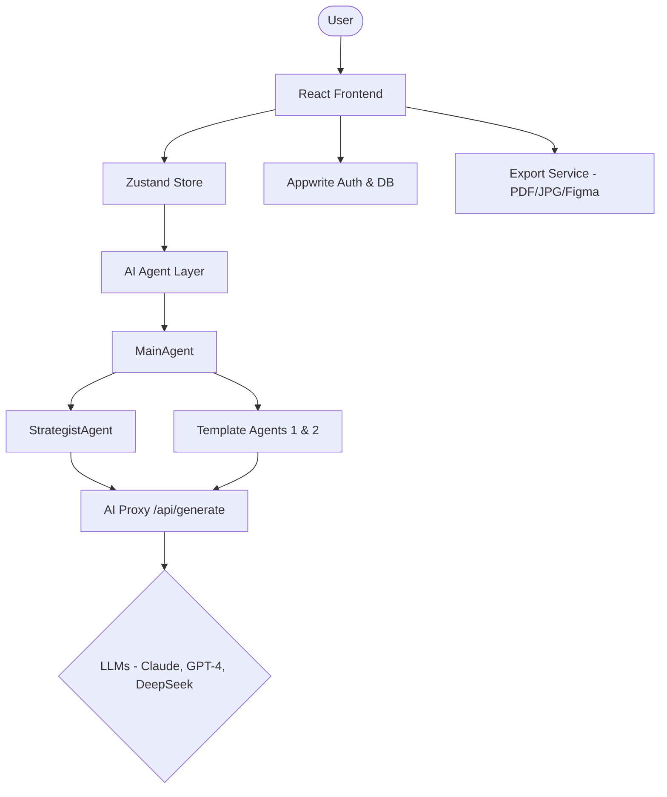

# Project Architecture: Agentic Carousel

This document outlines the high-level architecture, core components, and data flow of the **Agentic Carousel** project.

## 1. System Overview

Agentic Carousel is an AI-powered platform for generating high-quality LinkedIn carousels from various inputs (topics, URLs, PDFs, or YouTube videos). It uses a multi-agent orchestration system to refine content strategy and generate slide layouts.

## 2. Tech Stack

- **Frontend**: React (Vite), Tailwind CSS (for some layouts), Lucide Icons, Zustand (State Management).
- **Backend / API**: Express (Local usage), Vercel Serverless Functions (Production).
- **AI / Agent Layer**: LangChain, OpenAI, Anthropic (Claude), Google (Gemini), DeepSeek (via OpenRouter).
- **Database / Auth**: Appwrite (User profiles, usage tracking).
- **Export Tools**: `jspdf` (PDF), `html2canvas` (JPG/PNG), Satori (SVG/Figma).

## 3. High-Level Architecture

## 4. AI Agent System

The project uses a hierarchical agent architecture to ensure content quality and viral appeal.

### 4.1 Orchestration (`MainAgent.ts`)
The `MainAgent` manages the workflow:
1. Validates input and updates UI progress stores.
2. Invokes the **Strategist Agent** to determine a "Viral Angle".
3. Passes the strategy to the selected **Template Agent**.
4. Overrides AI-suggested themes with user-selected brand presets.

### 4.2 Strategist Agent (`StrategistAgent.ts`)
Analyzes the source material (text, URL, etc.) and generates a strategic concept. It focuses on the "hook" and the logical flow that makes a "viral" LinkedIn post.

### 4.3 Template Agent (`TemplateAgent.ts`)
Specialized agents that take the viral angle and generate structured JSON containing:
- Specific copy for each slide (Headline, Body, CTA).
- Layout suggestions.
- Visual theme suggestions (colors, gradients).

## 5. State Management (`/store`)

- **useAuthStore**: Manages user authentication status (via Appwrite) and tracks free-tier usage.
- **useCarouselStore**: The central state for the current carousel being edited, including:
    - Slides content.
    - Theme configuration (Backgrounds, Typography, Branding).
    - Generation status and progress.

## 6. API & Integration Layer

### 6.1 AI Proxy (`/api/generate.ts`)
A Vercel serverless function that acts as a secure bridge to LLM providers.
- **Hybrid Auth**: Supports "Bring Your Own Key" (BYOK) and a system-managed Free Tier.
- **Provider Support**: Seamlessly routes requests to OpenAI, Anthropic, or OpenRouter.

### 6.2 External Data Sources
- **YouTube**: A dedicated Express endpoint (`/api/youtube-transcript`) fetches transcripts using `youtube-transcript`.
- **Figma**: Uses `satori` to convert HTML/CSS into SVG structures compatible with Figma's copy-paste buffer.

## 7. Data Flow (Carousel Generation)

1. **User Input**: User provides a topic or URL.
2. **Preprocessing**: Frontend extracts content (PDF parsing, YouTube transcript, etc.).
3. **Agent Loop**:
    - `MainAgent` triggers.
    - `StrategistAgent` → Generates "Viral Angle".
    - `TemplateAgent` → Generates "Slide Structure" (JSON).
4. **Theming**: System applies the active "Brand Preset" to the generated slides.
5. **Rendering**: `CarouselPreview` renders the slides using the generated JSON and applied theme.
