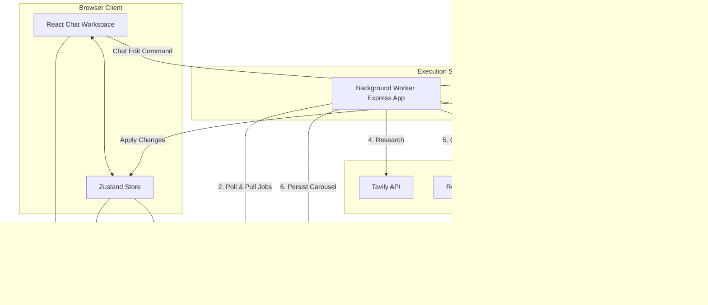

# Project Architecture: Agentic Carousel

This document outlines the high-level architecture, core components, and data flow of the **Agentic Carousel** project.

## 1. System Overview

Agentic Carousel is an AI-powered platform for generating high-quality LinkedIn carousels from various inputs (topics, URLs, PDFs, or YouTube videos). It uses a background job queue and a multi-agent orchestration system to refine content strategy, generate layout structures, proofread copy, design sketches, and manage conversation memories.

---

## 2. Tech Stack

*   **Frontend**: React 19 (Vite), Tailwind CSS, Lucide Icons, Zustand (State Management).
*   **Background Worker**: Persistent Express.js service running locally or on Coolify, managing job polling and running core sub-agents.
*   **BaaS / Storage / Database**: Appwrite (Authentication, Database collections, Storage buckets for doodles, Job queues).
*   **AI & Search Integrations**:
    *   **LLM Providers**: Anthropic (Claude 3.5), OpenAI (GPT-4), Google AI Studio (Gemini), and Groq (Llama 3.3).
    *   **Tavily Search API**: Enables real-world search querying for web research enrichment.
    *   **Replicate API (Flux)**: Renders pencil sketches on white backgrounds.
*   **Export Engine**: `jspdf` (PDF), `html2canvas` (JPG/PNG), Satori (SVG/Figma).

---

## 3. High-Level Architecture Diagram

```mermaid
graph TD
    subgraph Client [Browser Client]
        UI[React Chat Workspace] <--> Store[Zustand Store]
    end

    subgraph BaaS [Appwrite Services]
        Auth[OAuth & Session]
        DB[Database: Carousels, Profiles, Jobs]
        Storage[Storage Buckets: Doodles]
    end

    subgraph Services [Execution Servers]
        Worker[Background Worker Express App]
        OrchestratorAPI[Orchestrator API Service]
    end

    subgraph External [AI & Web Services]
        Tavily[Tavily API]
        Replicate[Replicate Flux API]
        LLM[LLMs: Groq, Claude, Gemini]
    end

    UI --> Auth
    Store -- Save/Load --> DB
    
    %% Creation pipeline enqueues job
    Store -- 1. Enqueue Job --> DB
    Worker -- 2. Poll & Pull Jobs --> DB
    
    %% Worker executes agents
    Worker -- 3. Runs Agents --> LLM
    Worker -- 4. Research --> Tavily
    Worker -- 5. Generate Doodles --> Replicate
    Replicate -- Save WebP --> Storage
    Worker -- 6. Persist Carousel --> DB

    %% Conversational editor actions
    UI -- Chat Edit Command --> OrchestratorAPI
    OrchestratorAPI -- Runs Orchestrator / Memory --> LLM
    OrchestratorAPI -- Apply Changes --> Store
```

---

## 4. AI Agent System

The project uses a modular, multi-agent architecture with specific roles:

### 4.1 Orchestrator Agent (`OrchestratorAgent.ts`)
The orchestrator is the brain behind the live chat editor. In a single LLM inference call per message, it:
1.  Classifies user intent (`copy` updates, `design` updates, `image` regeneration, or conversational `answer`).
2.  Applies direct text edits or generates a structured sequence of design actions.
3.  Extracts inline preference updates for long-term memory profiles.

### 4.2 Memory Agent (`MemoryAgent.ts`)
Manages rolling conversation summaries. When chat logs scroll out of the active 10-message window, it compresses those messages into a dense, running history under ~150 words to avoid context limitations.

### 4.3 Research Agent (`ResearchAgent.ts`)
Analyzes raw topic/context density. If exploratory research is needed, it structures and runs queries against the Tavily Search API, returning structured summaries, citations, and trends.

### 4.4 Strategist Agent (`StrategistAgent.ts`)
Takes inputs and research summaries, transforming them into a highly targeted "Viral Angle" and Hook based on user vibes (e.g., *Contrarian*, *Storyteller*).

### 4.5 Template Agent (`TemplateAgent.ts`)
Renders the "Viral Angle" into structured JSON slides matching specific template constraints.

### 4.6 Proofreader Agent (`ProofreaderAgent.ts`)
An automated safety agent that scans finished slides to clean up spelling, grammar, and punctuation mistakes without changing the voice or tone.

### 4.7 Art Director Agent (`ArtDirectorAgent.ts`)
For sketch-based layouts (Template 3), it translates each slide's topic into a detailed visual metaphor prompt, passing it to Replicate to generate whiteboard doodles.

---

## 5. State Management (`/store`)

*   **`useAuthStore`**: Handles active Appwrite sessions, login states, and user credits.
*   **`useCarouselStore`**: Manages the current active carousel state, including:
    *   `slides`: Array of SlideContent.
    *   `theme`: Current color palette variables.
    *   `chatMessages` & `chatSummary`: Conversational logs and compacted memory.
    *   `activeJobId`: Monitored by the client to track background generation progress.

---

## 6. Data Flow: Generation Queue

1.  **Job Enqueue**: The user hits "Generate" in the dashboard. The client creates a job document in Appwrite and sets its state to `pending`.
2.  **Worker Execution**: The background worker picks up the job. It triggers:
    *   `ResearchAgent` (Tavily search queries).
    *   `StrategistAgent` (Angle synthesis).
    *   `TemplateAgent` (Slide generation).
    *   `ProofreaderAgent` (Quality pass).
    *   `ArtDirectorAgent` & `Replicate` (Doodle generation for Template 3).
3.  **Client Update**: The background worker updates the Appwrite job document status and progress. The client polls this document to render progress bars and success state.
4.  **Save & Retrieve**: On completion, the final carousel document is created in Appwrite, and the client loads the generated content into `useCarouselStore`.
