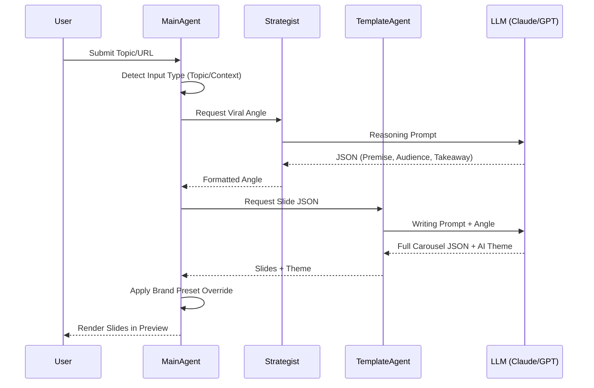

# Logic & Reasoning: Agentic Carousel

This document details the internal logic, prompt engineering, and fallback mechanisms that drive the AI agents in the Agentic Carousel project.

## 1. Prompt Engineering

The system uses a hierarchical prompting strategy where specialized agents handle different stages of the content lifecycle.

### 1.1 Strategist Agent (`StrategistAgent.ts`)
**Goal**: Transform raw input into a high-stakes "Viral Angle".
- **System Prompt**: Focuses on avoiding generic advice and applying specific "user vibes" (Contrarian, Analytical, Storyteller, Actionable).
- **Core Logic**:
  - **Topic Mode**: Brainstorms a new specific angle.
  - **Context Mode**: Extract single most interesting insight from source material.
- **Constraints**: Ignores generic titles like "How to be a leader" in favor of specific premises like "Stop celebrating 5% growth".

### 1.2 Template Agent (`TemplateAgent.ts`)
**Goal**: Convert a "Viral Angle" into structured slide JSON.
- **Rules**:
  - STRICT adherence to source material (no hallucinations).
  - Explicit slide counts and variant requirements (Hero start, Closing end).
  - Specific headline character limits (45-50 chars) and body lengths.
- **Visual Logic**: Agents are instructed to generate a "Bespoke Color Palette" matching the topic's emotion (e.g., Green for Money, Blue for Tech).

### 1.3 Editor Agent (`EditorAgent.ts`)
**Goal**: Contextual micro-refinements.
- **Sub-tasks**:
  - `refineText`: Targets Clarity, Punchiness, or Grammar based on user toggle.
  - `headlineAlts`: Generates 3 distinct variations (Utility-based, Curiosity-based, Contrarian-based).

## 2. Decision Logic & Routing

### 2.1 Input Type Detection
The system automatically classifies input in `MainAgent.ts`:
- **TOPIC**: Input < 500 characters.
- **CONTEXT**: Input > 500 characters (triggers summarization logic).

### 2.2 Template Selection
Routing happens based on user selection in the UI:
- **Template 1 (The Truth)**: Focuses on aggressive, direct, and high-contrast designs.
- **Template 2 (The Clarity)**: Focuses on educational, professional, and clean designs with architectural elements (arches).

### 2.3 Theme Override Logic
While AI suggests a theme, a secondary logic layer in `MainAgent.ts` overrides it if a User Preset is active:
1. AI generates a "Bespoke" theme.
2. System checks `store.presetId`.
3. If active, `resolveTheme()` calculates a new palette based on brand seeds and applies it, ensuring brand consistency over AI creativity.

## 3. Fallback Mechanisms

The system is designed for high reliability even when AI or External APIs fail.

### 3.1 Agent Failure Fallbacks
- **Strategist Failure**: If the `StrategistAgent` fails, the `MainAgent` catches the error and passes the raw user input directly to the Template Agent as the "Angle", ensuring the generation continues.
- **Template Failure**: Returns a basic "Error Slide" rather than a blank screen.

### 3.2 API & Usage Fallbacks
- **BYOK vs Free Tier**: `aiService.ts` checks for a user API key. If missing, it falls back to the system's "Free Tier".
- **Usage Tracking**: Uses optimistic incrementing. The usage count is updated in the database *before* the request completes to prevent race conditions during free-tier usage.

### 3.3 Data Source Fallbacks
- **YouTube**: If a transcript is not found or disabled, the system provides a specific error message (`404`) instead of a generic generation failure, allowing the user to provide text manually.

## 4. Workflow Sequence

