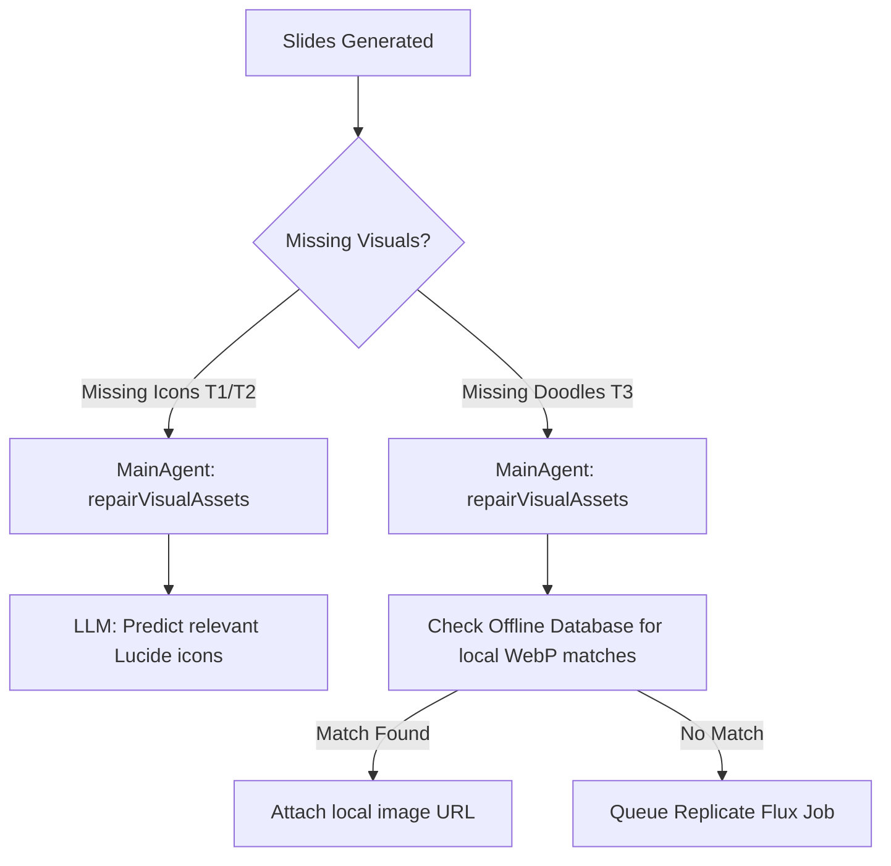
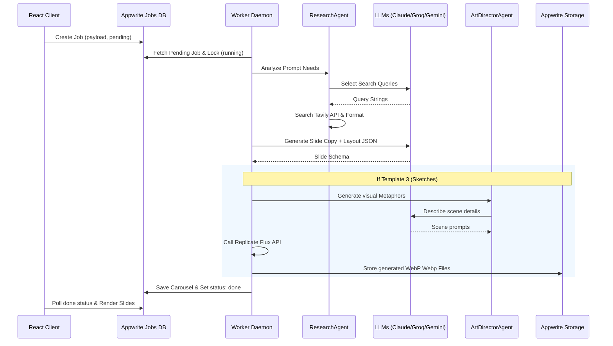

# Logic & Reasoning: Agentic Carousel

This document details the internal agent logic, classification prompts, fallback pathways, and validation rules that govern the Agentic Carousel platform.

---

## 1. Conversational Agent Logic

The editing workspace is governed by two key interactive agents: `OrchestratorAgent` and `MemoryAgent`.

### 1.1 Intent Classification (`OrchestratorAgent.ts`)
The orchestrator reads the user's message, the rolling chat summary, and the active slides. It classifies the message into one of four intent buckets:
*   **`copy`**: The user wants to rewrite text (e.g., *"Make slide 3 shorter"*).
*   **`design`**: The user wants to adjust formatting, templates, or color presets (e.g., *"Change layout to portrait"*).
*   **`image`**: The user wants to update or regenerate a doodle (e.g., *"Draw a rocket instead of a key"*).
*   **`answer`**: General advice, greeting, or explanation (e.g., *"Why did you use blue?"*).

#### Intent Classification Fallbacks:
*   **Command Parsing**: If a user issues a clear command (like *"rewrite"* or *"make it punchier"*), the system uses `COPY_COMMAND_RE` regex checks to force a copy edit.
*   **Design Action Fallback**: If the LLM generates a design modification in its conversational reply but fails to populate the structured `designActions` array, the system triggers `parseDesignActionsFallback()`. This deterministic helper parses keywords from the user's message (e.g., *"square"*, *"portrait"*, *"doodle"*, *"signature bottom right"*) and executes them client-side.
*   **`forcedCopyEdit`**: If a copy request fails to return valid slides due to LLM formatting errors, the system triggers a focused single-purpose rewrite fallback call with a simpler, restricted schema.

### 1.2 Rolling Compaction Logic (`MemoryAgent.ts`)
To prevent token bloat and context degradation, the system limits the chat history sent to the LLM to the last 10 messages. 
*   **Compaction Trigger**: When messages scroll out of the 10-message window, `MemoryAgent` is executed.
*   **Prompt Constraints**: The agent is prompted to merge and condense the old history into the existing summary, focusing on decisions made, style preferences, and finalized edits. It must stay under ~150 words and drop obsolete details.
*   **Compaction Fallback**: If the LLM call fails, the agent executes `deterministicFallback()`, compiling a simple, line-by-line summary (`User: [text] / Agent: [text]`) up to a hard-capped limit of 4,000 characters.

---

## 2. Layout & Metaphor Rules

Different visual templates enforce distinct logical guidelines on content generation:

### 2.1 Template 4 (The Statement) Rules
*   **Sentence-Case Headlines**: Unlike Templates 1–3 which uppercase all headlines, Template 4 uses standard sentence case.
*   **Accent Phrase Highlighter**: The agent must identify and output an `accentPhrase` which is an *exact substring* of the slide's headline. The SVG injector matches this string and applies the brand's primary accent color.

### 2.2 Template 3 (The Sketch) Metaphor Rules
The `ArtDirectorAgent` generates image prompts based on these core guidelines:
*   **Narrative Tension**: Avoid static objects (e.g., *"a key"*). Prefer narrative visual metaphors (e.g., *"a stick figure unlocking a massive gate"*).
*   **Labeled Elements**: Prompt Flux to draw annotations in all-caps inside single quotes (e.g., *"a computer labeled 'DATABASE'"*).
*   **High Contrast**: Show the "pain point" vs the "solution" in the scene layout.
*   **Flux Envelope**: Every scene is automatically wrapped in a style envelope: `A simple hand-drawn doodle sketch of [scene], thick black marker lines, rough outlines, grey scribble shading...`.

---

## 3. Fallback Pathways & Visual Asset Repair

The system uses self-healing loops to guarantee content displays cleanly:

```mermaid
graph TD
    A[Slides Generated] --> B{Missing Visuals?}
    
    B -- Missing Icons T1/T2 --> C[MainAgent: repairVisualAssets]
    B -- Missing Doodles T3 --> D[MainAgent: repairVisualAssets]
    
    C --> E[LLM: Predict relevant Lucide icons]
    D --> F[Check Offline Database for local WebP matches]
    
    F -- Match Found --> G[Attach local image URL]
    F -- No Match --> H[Queue Replicate Flux Job]
```

1.  **Icon Repair**: If a Template 1 or 2 slide is missing a Lucide icon, `getVisualAssetsForSlides` queries a lightweight LLM task to select a relevant icon from the allowed list.
2.  **Doodle Matching Fallback**: For Template 3 doodles, the system first runs `findMatchingImage()`. If a matching vector sketch is already indexed in the local asset directory, it returns the local path instantly, saving Replicate API tokens. If no local match exists, it triggers a Replicate queue job.
3.  **BYOK Retirement**: All LLM routing is now server-managed. The application no longer supports or checks for client-supplied keys, preventing user configuration errors.

---

## 4. End-to-End Execution Sequence

This diagram maps out how a user generation query moves through the background worker.

```mermaid
sequenceDiagram
    participant U as React Client
    participant J as Appwrite Jobs DB
    participant W as Worker Daemon
    participant R as ResearchAgent
    participant L as LLMs (Claude/Groq/Gemini)
    participant A as ArtDirectorAgent
    participant S as Appwrite Storage

    U->>J: Create Job (payload, pending)
    W->>J: Fetch Pending Job & Lock (running)
    
    W->>R: Analyze Prompt Needs
    R->>L: Select Search Queries
    L-->>R: Query Strings
    R->>R: Search Tavily API & Format
    
    W->>L: Generate Slide Copy + Layout JSON
    L-->>W: Slide Schema
    
    rect rgb(240, 248, 255)
        Note over W,S: If Template 3 (Sketches)
        W->>A: Generate visual Metaphors
        A->>L: Describe scene details
        L-->>A: Scene prompts
        W->>W: Call Replicate Flux API
        W->>S: Store generated WebP Webp Files
    end

    W->>J: Save Carousel & Set status: done
    U->>J: Poll done status & Render Slides
```
