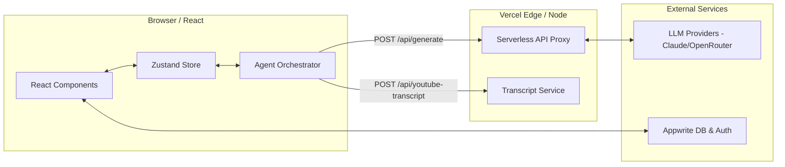
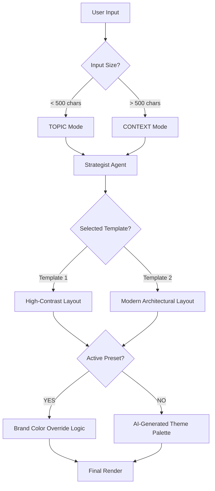

# Technical Deep Dive: Agentic Carousel

This document provides a deep technical analysis of the Agentic Carousel platform, designed for senior developers and architects.

## 1. System Architecture & Data Flow

The system follows a modern decoupled architecture where the frontend manages complex state and orchestration, while the backend provides lightweight, stateless AI proxies.

### 1.1 Data Flow Diagram

## 2. Core Technology Stack

- **Frontend**: React 19 (Vite)
  - *Rationale*: Low overhead, fast HMR, and broad community support.
- **State Management**: Zustand 5
  - *Rationale*: Minimalist, hook-based state management that handles deeply nested carousel structures without the boilerplate of Redux.
- **AI Integration**: LangChain Core + LLM SDKs (@anthropic-ai/sdk, @google/generative-ai)
  - *Rationale*: Standardized prompt templates and structured output handling.
- **Backend**: Express (Local) & Vercel Node Runtime (Production)
  - *Rationale*: Seamless deployment as serverless functions with automatic scaling and BYOK security.
- **Database/Auth**: Appwrite 21
  - *Rationale*: Comprehensive BaaS providing authentication, document database, and file storage for brand kits and profile images.

## 3. The "Agentic" Logic Breakdown

### 3.1 Strategist-First Pattern
Unlike simple prompt-to-result systems, this project implements a **Reasoning Step** before the **Writing Step**.
- **The Brain (Strategist)**: Analyzes input using a "Reasoning Loop" to identify hooks, audience segments, and value propositions. Result: A high-level strategy object.
- **The Writer (Template Agent)**: Takes the strategy object and "executes" it into slide copy.
- **Result**: Significant reduction in "Generic AI Content" by forcing the model to define a strategy first.

### 3.2 Decision Tree: Template & Brand Overrides

## 4. Performance & Latency Engineering

### 4.1 Granular Progress Tracking
AI generations can take 10-30 seconds. We avoid a "black box" experience by using a granular state store in `useCarouselStore`:
- **Progressive UI**: The UI updates at key architectural milestones (Initializing -> Strategizing -> Writing -> Theming).
- **Zustand Selectors**: Components subscribe only to `generationStatus`, preventing expensive re-renders of the entire editor during processing.

### 4.2 Optimistic Usage Tracking
To prevent "Double Spend" on free tier credits:
- **Pre-increment Logic**: `aiService.ts` increments the usage count in Appwrite *before* the LLM call.
- **Recovery**: If the LLM call fails, the store refreshes the count from the server to ensure accuracy.

### 4.3 Vercel Serverless Optimizations
- **Inlining**: Vercel-specific constants and helpers are inlined in `/api/generate.ts` to reduce module resolution overhead and cold start latency.
- **JSON Sanitization**: Custom logic (`cleanJsonResponse`) handles the erratic behavior of LLMs (e.g., wrapping JSON in markdown blocks) without expensive parsing libraries.

## 5. Critical Dependencies & Versions

| Package | Version | Purpose |
| :--- | :--- | :--- |
| `react` | `^19.2.0` | Core UI Framework |
| `zustand` | `^5.0.9` | State Management |
| `appwrite` | `^21.5.0` | Auth & Backend-as-a-Service |
| `satori` | `0.10.13` | HTML/CSS to SVG (Figma Export) |
| `jspdf` | `^3.0.4` | PDF Generation |
| `lucide-react` | `^0.555.0`| Icon System |
