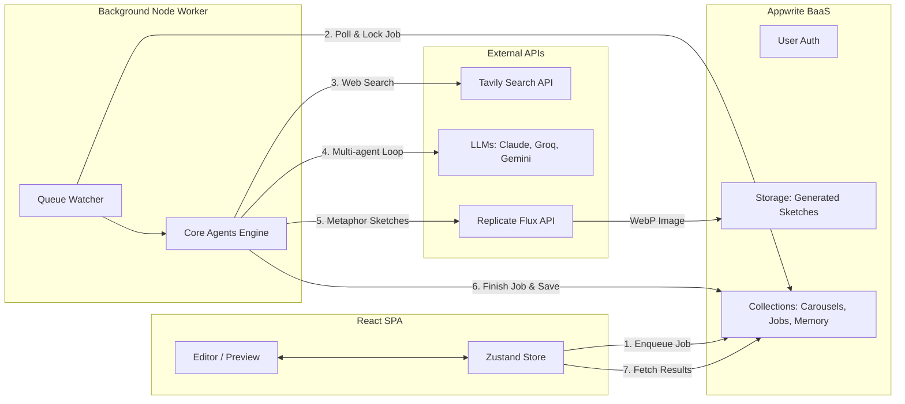
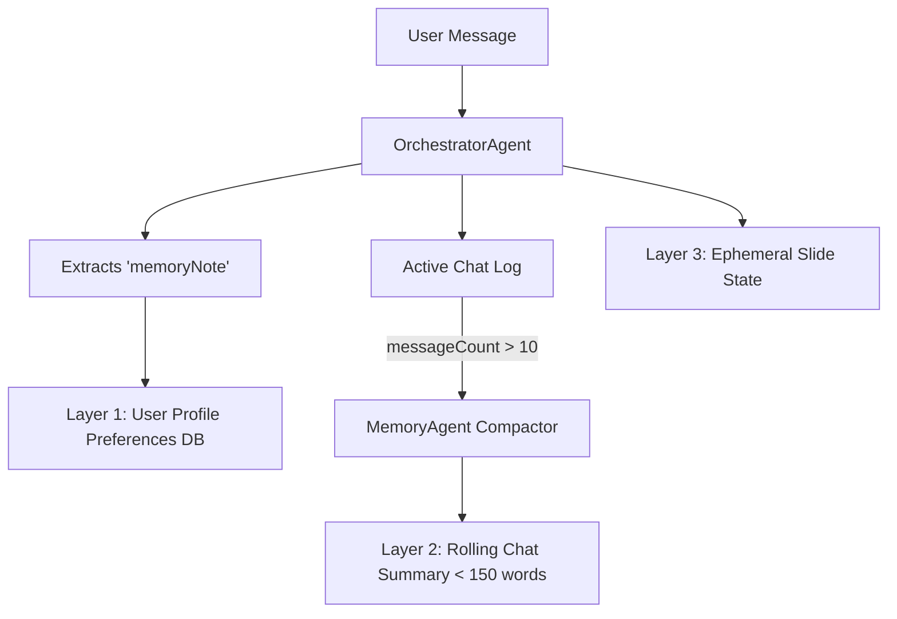

# Technical Deep Dive: Agentic Carousel

This document provides a deep technical analysis of the Agentic Carousel platform, designed for senior developers and architects.

---

## 1. System Architecture & Data Flow

The system follows a modern decoupled architecture where the React frontend manages the immediate UI state and chat editor actions, while long-running jobs (generation and heavy edits) are delegated to a persistent background worker queue.

### 1.1 Data Flow Diagram

```mermaid
graph LR
    subgraph Client [React SPA]
        UI[Editor / Preview]
        Store[Zustand Store]
    end
    
    subgraph WorkerService [Background Node Worker]
        Queue[Queue Watcher]
        Agents[Core Agents Engine]
    end
    
    subgraph StorageAuth [Appwrite BaaS]
        Auth[User Auth]
        DB[Collections: Carousels, Jobs, Memory]
        Storage[Storage: Generated Sketches]
    end

    subgraph External [External APIs]
        LLM[LLMs: Claude, Groq, Gemini]
        Tavily[Tavily Search API]
        Replicate[Replicate Flux API]
    end

    UI <--> Store
    Store -- 1. Enqueue Job --> DB
    Queue -- 2. Poll & Lock Job --> DB
    Queue --> Agents
    Agents -- 3. Web Search --> Tavily
    Agents -- 4. Multi-agent Loop --> LLM
    Agents -- 5. Metaphor Sketches --> Replicate
    Replicate -- WebP Image --> Storage
    Agents -- 6. Finish Job & Save --> DB
    Store -- 7. Fetch Results --> DB
```

---

## 2. Core Technology Stack

*   **Frontend**: React 19 (Vite) for low overhead, hot module replacement, and state updates.
*   **State Management**: Zustand 5, providing minimalist hook-based state stores that handle deeply nested slide properties without boilerplate.
*   **AI Integration**: Raw LLM SDK APIs (Anthropic, Google, and Groq) routed through backend services (Vercel Edge functions for short requests, Node background tasks for generation).
*   **Database/Auth**: Appwrite 21, managing authentication, document tables, user preferences, and WebP asset storage.
*   **Background Worker**: Persistent Node/Express application polling Appwrite queues for resilient, non-blocking execution.

---

## 3. Background Job Queue Architecture

To prevent API timeouts and allow users to safely navigate away or close the tab, the creation and visual edit flows operate asynchronously:

1.  **Job Lifecycle**:
    *   **Creation**: User submits parameters. Client calls `/jobs` on the Worker, creating a `pending` job document in Appwrite.
    *   **Locking & Execution**: The worker's queue manager pops the job, marks it `running`, locks it to prevent duplicate execution, and reports numeric progress (0–100%).
    *   **Completion**: On success, the worker creates the finalized carousel document, updates the job to `done`, and writes a result summary. If it fails, it changes the status to `failed` with stack details.
2.  **Rate Limiting**: The worker implements a rolling per-user rate limit (20 creations or edits per 5 minutes) via a sliding time window map.
3.  **Staleness Watcher**: A background daemon inspects the database hourly, checking for jobs stuck in `running` state (e.g., due to sudden worker crashes or unhandled exceptions) and automatically resets or fails them.

---

## 4. The Conversational Orchestrator & Three-Layer Memory

The editor is built as a chat-driven agentic workspace. Instead of standard form inputs, user prompts route to the `OrchestratorAgent` which decides how to modify the carousel.

### 4.1 Single-Inference Intent Classification
Every message sent by the user results in a single, high-density LLM call. The orchestrator classifies the intent into one of four categories:
*   **`copy`**: Edits slide text. Returns a list of text patches (`preHeader`, `headline`, `body`, `footer`, `listItems`, `accentPhrase`) that merge onto existing slides.
*   **`design`**: Triggers layout commands (template swaps, palette presets, SVG pattern changes, or signature position movement). Executed instantly on the client with zero extra LLM cost.
*   **`image`**: Metaphor sketch edits for Template 3. Spawns a Replicate Flux job with a new scene description.
*   **`answer`**: A simple conversational reply (e.g., explaining why a design choice was made) without editing the slides.

### 4.2 Three-Layer Memory System
To maintain conversation coherence without exceeding model context limits, the system partitions state:

```mermaid
graph TD
    UserMsg[User Message] --> Orchestrator[OrchestratorAgent]
    Orchestrator --> ExtrMemory[Extracts 'memoryNote']
    ExtrMemory --> Durable[Layer 1: User Profile Preferences DB]
    
    Orchestrator --> ChatHistory[Active Chat Log]
    ChatHistory -- messageCount > 10 --> Compacter[MemoryAgent Compactor]
    Compacter --> Summary[Layer 2: Rolling Chat Summary < 150 words]
    
    Orchestrator --> Context[Layer 3: Ephemeral Slide State]
```

1.  **Durable Memory (User Profile)**: Long-term design style preferences (e.g., "User prefers high-contrast dark colors and minimalist layouts") stored in Appwrite Profiles.
2.  **Rolling Chat Summary (`MemoryAgent`)**: Once active message histories exceed the last 10 messages, the `MemoryAgent` is triggered asynchronously. It compresses the messages scrolling out of the window, merging them into a running summary string capped at 4,000 characters (ideally under 150 words), dropping superseded inputs.
3.  **Ephemeral State**: The current slide JSON and template properties passed directly in the API payload.

---

## 5. Visual Asset Repair Loop

`MainAgent.ts` executes an asset repair cycle on the client to guarantee slides never have missing assets:
*   **Template 1 & 2**: Assures every slide maps to a valid icon name from the shared `Lucide` library.
*   **Template 3**: If a slide is missing a doodle sketch illustration, it passes slide topics to the image matcher to find a local match or trigger background generation.

---

## 6. Layout Templates Specifics

*   **Template 3 (The Sketch)**: Integrates with `ArtDirectorAgent` to write narrative sketch prompts (e.g., "A stick figure holding a giant key labeled 'API'") which render via Flux.
*   **Template 4 (The Statement)**: Premium typographic layout. It keeps headlines in sentence-case. It uses the `accentPhrase` parameter—a exact substring matching part of the headline—which the SVG injector renders in the primary brand accent color.
