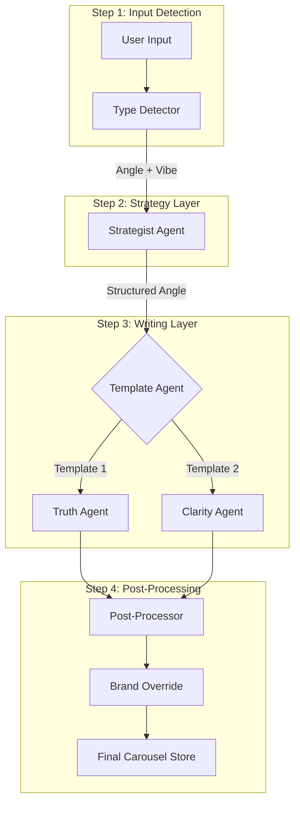

# Generation Workflow: Agentic Carousel

This document provides a technical walkthrough of the end-to-end generation pipeline, from user input to the final rendered carousel.

## 1. Pipeline Architecture

The system operates as a **Sequential Agent Chain** orchestrated by the `MainAgent`.



---

## 2. Step-by-Step Breakdown

### Node 1: Input & Type Detection
**Location**: `MainAgent.ts`
- **Logic**: 
  - If `content.length < 500` -> `TOPIC` Mode.
  - If `content.length >= 500` -> `CONTEXT` Mode (triggers truncation to 24k chars).
- **Final Output**: An `AgentContext` object containing the source content, input mode, and user-defined vibe.

### Node 2: The Strategist (Reasoning Branch)
**Location**: `StrategistAgent.ts`
- **Goal**: Define the "Hook" and "Viral Strategy".
- **System Prompt**: 
  > You are a Viral Content Strategist. Your task is to analyze the input and generate a specific 'Viral Angle' or 'Premise'. Ignore generic advice. If Vibe is 'Contrarian' -> Find a myth to bust.
- **Output Schema**:
  ```json
  {
    "premise": "String (Punchy hook)",
    "audience": "String (Specific target)",
    "takeaway": "String (Core lesson)"
  }
  ```
- **Final Output**: A formatted Markdown string containing the premise, audience, and takeaway.

### Node 3: The Writer (Execution Branch)
**Location**: `Template1Agent.ts` / `Template2Agent.ts`
- **Goal**: Write the actual slide copy and suggest visual elements.
- **System Prompt (Generic snippet)**:
  > You are a LinkedIn Ghostwriter. Stick strictly to the provided Angle. Write a {count}-slide carousel. Generate complete, impactful headlines. Max headline length: 50 chars.
- **Output Schema**:
  ```json
  {
    "theme": { "background": "Hex", "textDefault": "Hex", "textHighlight": "Hex" },
    "slides": [
      {
        "variant": "hero | body | list | closing",
        "headline": "...",
        "body": "...",
        "icon": "LucideIconName"
      }
    ]
  }
  ```
- **Final Output**: A structured object containing a `slides` array and an AI-generated `theme`.

### Node 4: Post-Processing & Brand Override
**Location**: `MainAgent.ts`
- **Logic**: 
  1. Fixes common LLM errors (e.g., `type` vs `variant` in slide objects).
  2. Checks for `store.presetId`.
  3. If present, calls `resolveTheme(presetSeeds)` to replace the AI's theme colors with the user's brand identity.
- **Final Output**: Hydrated Zustand store containing the final slides and finalized theme.

---

## 3. Detailed Prompt Table

| Agent | Core System Prompt Focus | output Format |
| :--- | :--- | :--- |
| **Strategist** | Identification of "Viral Angles", Myth-busting, Audience segmenting. | Markdown Strategy Card |
| **Writer (T1)** | Direct, high-contrast, bold headlines, aggressive tone. | Full Slide JSON + AI Palette |
| **Writer (T2)** | Professional, clean, educational, optimistic tone. | Full Slide JSON + AI Palette |
| **Editor** | Clarity, Punchiness, Grammar (contextual refinements). | Refined String / Alt Headlines |

## 4. State Transformation (Example)

1. **User Input**: "Leadership" + Vibe: "Contrarian".
2. **Strategist Node**: "Premise: Your Weekly 1:1s are a waste of time. Do this instead."
3. **Template Node**: 
   - Slide 1: "The 1:1 Illusion"
   - Slide 2: "Why status updates kill creativity..."
4. **Final Node**: Replaces AI Purple theme with "Ocean Tech" Brand Blue theme.
