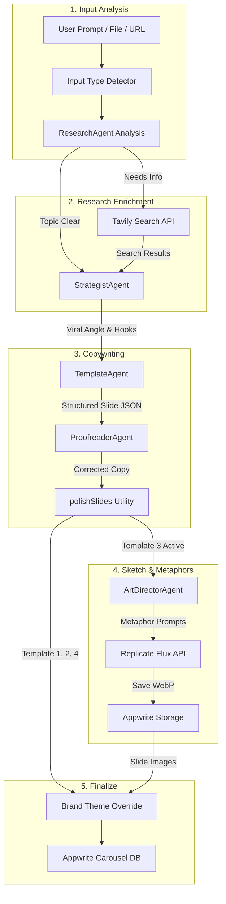

# Generation Workflow: Agentic Carousel

This document details the step-by-step pipeline from a raw user prompt or document upload to the final rendered slide deck.

---

## 1. Pipeline Architecture (Background Job Loop)

The creation of a carousel runs as a sequential chain of specialized AI agents managed asynchronously in the background queue.


```mermaid
graph TD
    subgraph Step_1 [1. Input Analysis]
        Input[User Prompt / File / URL] --> Mode[Input Type Detector]
        Mode --> ResearchNeeds[ResearchAgent Analysis]
    end

    subgraph Step_2 [2. Research Enrichment]
        ResearchNeeds -- Needs Info --> Tavily[Tavily Search API]
        ResearchNeeds -- Topic Clear --> Strategy[StrategistAgent]
        Tavily -- Search Results --> Strategy
    end

    subgraph Step_3 [3. Copywriting]
        Strategy -- Viral Angle & Hooks --> Template[TemplateAgent]
        Template -- Structured Slide JSON --> Proofreader[ProofreaderAgent]
        Proofreader -- Corrected Copy --> Polish[polishSlides Utility]
    end

    subgraph Step_4 [4. Sketch & Metaphors]
        Polish -- Template 3 Active --> ArtDirector[ArtDirectorAgent]
        ArtDirector -- Metaphor Prompts --> Replicate[Replicate Flux API]
        Replicate -- Save WebP --> AppwriteStorage[Appwrite Storage]
    end

    subgraph Step_5 [5. Finalize]
        Polish -- Template 1, 2, 4 --> BrandOverride[Brand Theme Override]
        AppwriteStorage -- Slide Images --> BrandOverride
        BrandOverride --> Persist[Appwrite Carousel DB]
    end
```

---

## 2. Step-by-Step Breakdown

### Phase 1: Input Analysis & Research
*   **Location**: `ResearchAgent.ts`
*   **Process**:
    1.  Classifies input: prompts under 500 characters default to `TOPIC` mode; longer documents/files default to `CONTEXT` mode.
    2.  The `ResearchAgent` evaluates whether the prompt requires external information (e.g., current news, specific statistics, or technical trends).
    3.  If needed, it constructs up to 3 target queries and searches via the **Tavily API**, appending a `=== AI RESEARCH ENRICHMENT ===` block containing URLs, titles, and summaries to the prompt.

### Phase 2: Strategic Hook Synthesis
*   **Location**: `StrategistAgent.ts`
*   **Process**:
    1.  Ingests the original prompt + any research results.
    2.  Generates a high-stakes "Viral Angle" and a hook specific to the selected user vibe (e.g., *Contrarian*, *Storyteller*, *Analytical*, or *Actionable*).
    3.  Outputs a Markdown card detailing the target audience, the core takeaway, and the hook strategy.

### Phase 3: Slide Copywriting
*   **Location**: `TemplateAgent.ts`
*   **Process**:
    1.  Fuses the Strategist's angle with the selected visual template style.
    2.  Generates copy matching strict constraints (word count ceilings, structure, and slide numbers).
    3.  Outputs structured JSON containing themes and slide fields (`preHeader`, `headline`, `body`, `listItems`, `footer`).

### Phase 4: Copy Editing & Quality Proofing
*   **Location**: `ProofreaderAgent.ts` & `contentPolish.ts`
*   **Process**:
    1.  The JSON slides pass through `ProofreaderAgent` which runs a lightweight LLM call to catch grammar, spelling, and punctuation errors. It acts as a safety validator and is instructed never to alter the structure or tone.
    2.  `polishSlides` applies deterministic regex adjustments (removing markdown formatting inside headlines, title casing slide headers, and trimming whitespace).

### Phase 5: Sketching Metaphors (Template 3 Sketch only)
*   **Location**: `ArtDirectorAgent.ts` & `worker/doodleGen.ts`
*   **Process**:
    1.  `ArtDirectorAgent` translates slide contents into witty, contrasting visual metaphor descriptions (e.g., "A robot labeled 'API' walking through a wall while a human struggles with a locked door labeled 'UI'").
    2.  For each slide, it requests a WebP image from **Replicate** using the Flux Schnell model.
    3.  The images are uploaded to Appwrite Storage and their URLs are attached to the slide data.

### Phase 6: Brand Injection & Save
*   **Location**: `MainAgent.ts` & `carouselStoreServer.ts`
*   **Process**:
    1.  If the user has a selected brand preset, `resolveTheme()` replaces the AI-generated theme colors with the user's specific brand palette.
    2.  The final slides, theme, template, and formatting state are saved as a document in the Appwrite carousels database.

---

## 3. Data Transformation Example

1.  **Raw Input**: `"Why APIs are better than UIs"` (Vibe: Contrarian, Template 3)
2.  **Research Agent**: Adds research queries about API efficiency.
3.  **Strategist Agent**:
    ```json
    {
      "premise": "Stop building complex buttons. Build endpoints.",
      "audience": "Software Architects",
      "takeaway": "UIs slow down systems; APIs scale them."
    }
    ```
4.  **Template Agent**: Generates slide outline.
5.  **Proofreader Agent**: Fixes minor casing and capitalization in copy.
6.  **Art Director Agent**: Formulates sketch prompt:
    > "A simple hand-drawn doodle sketch of a robot walking through a wall labeled 'API' while a human struggles with a locked door labeled 'UI', line art, isolated on a plain white background."
7.  **Replicate (Flux)**: Returns `https://cloud.appwrite.io/.../doodle-123.webp` URL.
8.  **Output**: Hydrated carousel database record ready to render in the client browser.
